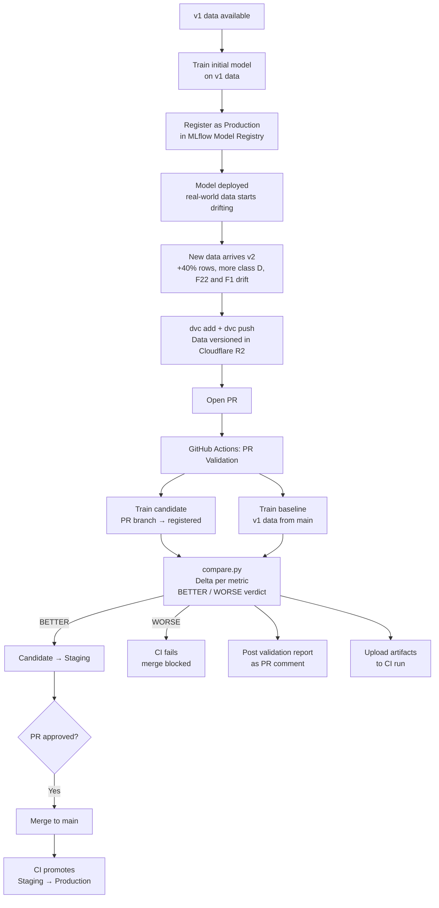

# MLOps SDG Pipeline

An end-to-end MLOps pipeline for a 4-class classification problem (`Target` ∈ A, B, C, D) on a tabular dataset of 30 anonymised features. It includes: data versioning, experiment tracking, CI-driven model comparison, model registry with automatic promotion, and Docker packaging for inference.

Training a classifier is the easy part. The harder problem is what happens *after* the first model is deployed: data evolves, models degrade silently, and teams need a reliable way to know whether a change makes the model better or worse before it reaches production.

This project builds the infrastructure that answers those questions automatically, on every pull request.

The model is a multiclass `LogisticRegression`: it outputs one probability per class (A, B, C, D) and predicts the most likely one.

---

## Pipeline overview



---

## Tech stack

| Layer | Tool |
|---|---|
| Data versioning | DVC + Cloudflare R2 |
| Experiment tracking | MLflow hosted on DagsHub |
| Model registry | MLflow Model Registry (aliases `Staging` / `Production`) |
| CI/CD | GitHub Actions |
| Containerisation | Docker (inference image via `Dockerfile.inference`) |
| Prediction store | SQL database via SQLAlchemy (SQLite by default, PostgreSQL via `DATABASE_URL`) |
| ML | scikit-learn |
| Testing | pytest |
| Language | Python 3.11 |

---

## Project structure

```
├── src/
│   ├── data/           # Dataset loading and versioning logic
│   ├── features/       # Feature selection (excluded columns) and preprocessing pipeline
│   ├── training/       # Model training and MLflow logging
│   ├── evaluation/     # Metrics, plots, and model comparison
│   ├── inference/      # Production model inference and prediction logging
│   └── utils/          # Shared I/O helpers
├── tests/              # Unit tests, mirrors the src/ layout above
├── pipelines/
│   └── orchestration.py   # Single CLI entrypoint for the full pipeline
├── data/
│   ├── v1.dvc             # Pointer to v1 dataset in R2
│   ├── v2.dvc             # Pointer to v2 dataset in R2
│   └── generate_v2.py     # Builds the drifted v2 dataset from v1
├── Dockerfile.inference   # Image for running Production model inference
└── .github/workflows/
    ├── pr_validation.yml  # CI: train, compare, comment, Staging → Production
    └── tests.yml          # CI: run the pytest suite
```

---

## Data

`data/v1/sdg.csv` has 500 rows, 30 features (`F1` to `F30`: 10 categorical, 20 numeric), a `Timestamp` and the `Target` class. Classes A, B and C have ~160 rows each; class D only 24 (~5%).

Findings from the exploratory analysis that shape the pipeline:

- **`F22` carries almost all the signal**: its class means are ~10 / 19 / 31 / 40 for A / B / C / D.
- **`Timestamp` is excluded (leakage)**: the month alone predicts the class with 94% accuracy (Jan → A, Apr → B, Jul → C, Oct → D). This is an artefact of how the data was generated, not a real pattern.
- **`F17` is excluded**: 90% of its values are missing.
- **`F4`, `F7`, `F8`, `F11`, `F13` are excluded**: job titles with ~110 unique values each in 500 rows and no relation to the target.

The excluded columns live in `EXCLUDED_COLUMNS` in `src/features/build_features.py`. Because training drops them before fitting, they are not part of the model signature either: inference inputs don't need them.

Since the target is multiclass, precision, recall and F1 are **macro-averaged** (the minority class D weighs as much as the others) and ROC AUC is **one-vs-rest, macro-averaged**.

### Data versioning

- **v1**: the original data, representing the state at initial deployment
- **v2**: a derived dataset simulating drift: +40% rows, more class D, an offset and extra noise on `F22`, more `error` values in `F1` (see `data/README.md`)

Data files are never committed to Git. DVC stores a small metadata pointer (`.dvc` file) in the repository while the actual CSV files live in Cloudflare R2.

---

## CI/CD workflow

### Tests

On every pull request (opened, synchronized, or reopened), the `tests.yml` workflow installs dependencies and runs the `pytest` suite in `tests/`. It's fully hermetic (no DVC pull and no MLflow/DagsHub secrets required) since the tests mock the dataset, point MLflow at a local file store and write predictions to a temporary SQLite file.

### Model validation and promotion

When a PR is opened or updated, GitHub Actions automatically:

1. Trains the **candidate model** on the PR branch and registers it in the MLflow Model Registry (without alias)
2. Checks out `main` and trains the **baseline model** on v1 data
3. Runs `src/evaluation/compare.py` to compute metric deltas and apply a **BETTER / WORSE OR EQUAL** verdict (candidate F1 and ROC AUC must both be ≥ baseline). If the verdict is not BETTER, **the job fails** and, with branch protection enabled, the PR can't be merged
4. Only if the candidate won: moves the `Staging` alias to the candidate version
5. Posts the validation report as a PR comment (updated in place on re-runs, and also posted when the check fails)
6. Uploads all reports as downloadable CI artifacts

When the PR is merged into `main`, the `promote` job moves the `Production` alias to the version marked as `Staging`. Only a model that won the comparison and was reviewed reaches production.

---

## Model registry

The MLflow Model Registry governs which version of `sdg-model` is deployed at any point in time, using aliases:

| Alias | Meaning |
|---|---|
| `Staging` | Won the comparison on a PR, not yet merged |
| `Production` | The currently deployed model |

The very first `Production` version has to be created once by hand (there is no baseline to compare against yet):

```bash
python pipelines/orchestration.py --data-version v1 --experiment-name sdg-main \
  --run-name initial-production --output-dir reports/initial \
  --register-model --model-stage Production
```

---

## Inference

`src/inference/predict.py` loads `sdg-model@Production` from the MLflow Model Registry, predicts the class of one record, and inserts the result as a row of a `predictions` table. Each row stores `prediction_id`, `timestamp`, `model_version`, `input_data` (as JSON), and `prediction`.

The `Production` alias is resolved to a concrete version before the model is loaded, so the stored `model_version` is always the version that produced the prediction.

The database is taken from `--db-url` or the `DATABASE_URL` environment variable (default: SQLite file `predictions/predictions.db`), so the same code works with a local SQLite file or a managed PostgreSQL by changing only the URL.

```bash
# Build the inference image
docker build -f Dockerfile.inference -t sdg-inference .

# Run one inference; the SQLite file is kept in ./predictions on the host.
# --user runs the container as your user, so predictions.db is owned by you and not by root;
# HOME=/tmp gives that user a writable home directory inside the container
docker run --rm \
  --user "$(id -u):$(id -g)" \
  -e HOME=/tmp \
  --env-file .env \
  -v "$(pwd)/predictions:/app/predictions" \
  sdg-inference \
  --input '{"F1": "error", "F2": "success", "F3": 0.0, "F5": 0.3418, "F6": 0.0, "F9": 0.0, "F10": 0.5333, "F12": 0.0, "F14": "success", "F15": 0.7687, "F16": "success", "F18": 0.0, "F19": "unknown", "F20": null, "F21": 0.0, "F22": 17.7918, "F23": -73.3180, "F24": 0.0, "F25": 0.2662, "F26": 103.2730, "F27": 0.0, "F28": 108.1766, "F29": -98.5651, "F30": 0.1691}'

# Look at the stored predictions
sqlite3 predictions/predictions.db "SELECT * FROM predictions;"
```

The MLflow/DagsHub credentials (and optionally `DATABASE_URL`) are passed through from `.env`.

---

## Training locally

```bash
# Install dependencies
pip install -r requirements.txt

# Pull versioned data
dvc pull

# Train on v1
python pipelines/orchestration.py \
  --data-version v1 \
  --experiment-name sdg-local \
  --run-name my-run \
  --output-dir reports/local

# Compare candidate vs baseline
python src/evaluation/compare.py \
  --candidate reports/candidate/train_metrics.json \
  --baseline  reports/baseline/train_metrics.json \
  --output-dir reports/
```

---

## Running tests

```bash
# Install dependencies (includes pytest)
pip install -r requirements.txt

# Run the test suite
pytest
```

The suite is hermetic: it doesn't need `dvc pull` or MLflow/DagsHub credentials.
